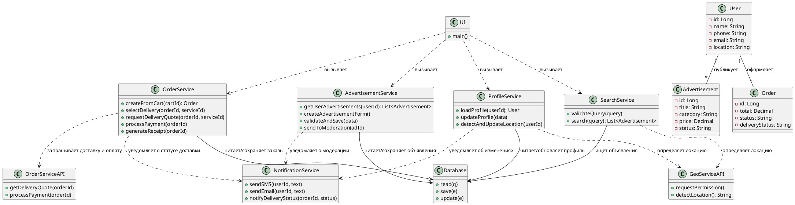

```plantuml
@startuml
class UI {
  + main()
}

class User {
  - id: Long
  - name: String
  - phone: String
  - email: String
  - location: String
}

class Advertisement {
  - id: Long
  - title: String
  - category: String
  - price: Decimal
  - status: String
}

class Order {
  - id: Long
  - total: Decimal
  - status: String
  - deliveryStatus: String
}

class AdvertisementService {
  + getUserAdvertisements(userId): List<Advertisement>
  + createAdvertisementForm()
  + validateAndSave(data)
  + sendToModeration(adId)
}

class SearchService {
  + validateQuery(query)
  + search(query): List<Advertisement>
}

class OrderService {
  + createFromCart(cartId): Order
  + selectDelivery(orderId, serviceId)
  + requestDeliveryQuote(orderId, serviceId)
  + processPayment(orderId)
  + generateReceipt(orderId)
}

class ProfileService {
  + loadProfile(userId): User
  + updateProfile(data)
  + detectAndUpdateLocation(userId)
}

class OrderServiceAPI {
  + getDeliveryQuote(orderId)
  + processPayment(orderId)
}

class NotificationService {
  + sendSMS(userId, text)
  + sendEmail(userId, text)
  + notifyDeliveryStatus(orderId, status)
}

class Database {
  + read(q)
  + save(e)
  + update(e)
}

class GeoServiceAPI {
  + requestPermission()
  + detectLocation(): String
}

UI ..> AdvertisementService : вызывает
UI ..> SearchService : вызывает
UI ..> OrderService : вызывает
UI ..> ProfileService : вызывает

User "1" -- "*" Advertisement : публикует
User "1" -- "*" Order : оформляет

AdvertisementService --> Database : читает/сохраняет объявления
AdvertisementService ..> NotificationService : уведомляет о модерации

SearchService --> Database : ищет объявления
SearchService ..> GeoServiceAPI : определяет локацию

OrderService --> Database : читает/сохраняет заказы
OrderService ..> OrderServiceAPI : запрашивает доставку и оплату
OrderService ..> NotificationService : уведомляет о статусе доставки

ProfileService --> Database : читает/обновляет профиль
ProfileService ..> GeoServiceAPI : определяет локацию
ProfileService ..> NotificationService : уведомляет об изменениях
@enduml
```