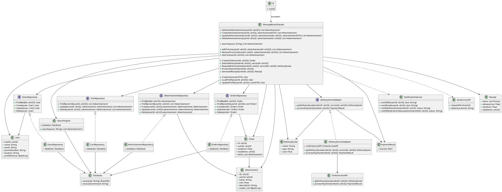

```plantuml
@startuml
class UI {
  + main()
}

class MessageBoardFacade {
  + GetUserAdvertisements(userId: uInt32): List<Advertisement>
  + CreateAdvertisement(userId: uInt32, advertisementDTO): List<Advertisement>
  + UpdateAdvertisement(userId: uInt32, advertisementId: uInt32, advertisementDTO): List<Advertisement>
  + DeleteAdvertisement(userId: uInt32, advertisementId: uInt32): List<Advertisement>

  + Search(query: String): List<Advertisement>

  + AddToCart(userId: uInt32, advertisementId: uInt32): List<Advertisement>
  + RemoveFromCart(userId: uInt32, advertisementId: uInt32): List<Advertisement>
  + GetCart(userId: uInt32): List<Advertisement>

  + CreateOrder(userId: uInt32): Order
  + SelectDelivery(orderId: uInt32, serviceId: uInt32)
  + RequestDeliveryQuote(orderId: uInt32, serviceId: uInt32): DeliveryQuote
  + ProcessPayment(orderId: uInt32)
  + GenerateReceipt(orderId: uInt32): Receipt

  + CreateUser(userDTO): User
  + LoadProfile(userId: uInt32): User
  + UpdateProfile(userId: uInt32, userDTO): User
}


interface IUsersRepository {
  + FindById(id: uInt32): User
  + Create(user: User): User
  + Update(user: User): User
  + Delete(user: User)
}

interface IAdvertisementsRepository {
  + FindById(id: uInt32): Advertisement
  + FindByUserId(userId: uInt32): List<Advertisement>
  + Create(userId: uInt32,advertisement: Advertisement): Advertisement
  + Update(userId: uInt32,advertisement: Advertisement): Advertisement
  + Delete(userId: uInt32,advertisement: Advertisement)
}

interface IOrdersRepository {
  + FindById(id: uInt32): Order
  + FindByUserId(userId: uInt32): List<Order>
  + Create(order: Order): Order
  + Update(order: Order): Order
  + Delete(order: Order)
}

interface ICartRepository {
  + FindByUserId(userId: uInt32): List<Advertisement>
  + Update(userId: uInt32, advertisement: Advertisement): List<Advertisement>
  + Delete(userId: uInt32, advertisement: Advertisement): List<Advertisement>
}

interface IDeliveryServiceAdapter {
  + getDeliveryQuote(orderId: uInt32, serviceId: uInt32): DeliveryQuote
  + processPayment(orderId: uInt32): PaymentResult
}

class UsersRepository implements IUsersRepository{
  - database: Database
}

class AdvertisementsRepository implements IAdvertisementsRepository {
  - database: Database
}

class OrdersRepository implements IOrdersRepository {
  - database: Database
}

class CartRepository implements ICartRepository {
  - database: Database
}

class SearchEngine {
  - database: Database
  + search(query: String): List<Advertisement>
}

class DeliveryServiceAdapter implements IDeliveryServiceAdapter {
  - orderServiceAPI: OrderServiceAPI
  + getDeliveryQuote(orderId: uInt32, serviceId: uInt32): DeliveryQuote
  + processPayment(orderId: uInt32): PaymentResult
}

class NotificationService {
  + sendSMS(userId: uInt32, text: String)
  + sendEmail(userId: uInt32, text: String)
  + notifyDeliveryStatus(orderId: uInt32, status: String)
  + notifyModerationStatus(advertisementId: uInt32, status: String)
}

class Database {
  + query(sql: String): ResultSet
  + execute(command: String)
}

class OrderServiceAPI {
  + getDeliveryQuote(orderId: uInt32): DeliveryQuote
  + processPayment(orderId: uInt32): PaymentResult
}

class GeoServiceAPI {
  + requestPermission()
  + detectLocation(): String
}

class Advertisment {
  + idL uInt32
  + userId: uInt32
  + name: String
  + cost: Float
  + description: String
  + media: List<ByteArray>
}

class User {
  + userId: uInt32
  + name: String
  + email: String
  + phoneNumber: String
  + location: String
  + profilePicture: ByteArray
}

class Order {
  + id: uInt32
  + userId: uInt32
  + totalSum: Float
  + totalItems: uInt32
  + items: List<Advertisment>
}

class DeliveryQuote {
  + name: String
  + type: String
  + cost: Float
}

class PaymentResult {
  + Success: Bool
}

class Receipt {
  + items: List<String>
  + deliveryCost: Float
  + totalSum: Float
  + totalItems: uInt32
}

UI ..> MessageBoardFacade : вызывает

MessageBoardFacade --> Receipt 
MessageBoardFacade --> PaymentResult 
IDeliveryServiceAdapter  --> PaymentResult 
MessageBoardFacade --> DeliveryQuote 
IDeliveryServiceAdapter  --> DeliveryQuote
MessageBoardFacade --> Order
IOrdersRepository --> Order
Order --> Advertisment
MessageBoardFacade --> Advertisment
IAdvertisementsRepository--> Advertisment
MessageBoardFacade --> User
IUsersRepository--> User

MessageBoardFacade --> IUsersRepository
MessageBoardFacade --> IAdvertisementsRepository
MessageBoardFacade --> IOrdersRepository
MessageBoardFacade --> ICartRepository
MessageBoardFacade --> IDeliveryServiceAdapter 
MessageBoardFacade --> SearchEngine
MessageBoardFacade ..> NotificationService
MessageBoardFacade ..> GeoServiceAPI

UsersRepository --> Database
AdvertisementsRepository --> Database
OrdersRepository --> Database
CartRepository --> Database
SearchEngine --> Database

DeliveryServiceAdapter --> OrderServiceAPI
@enduml
```
