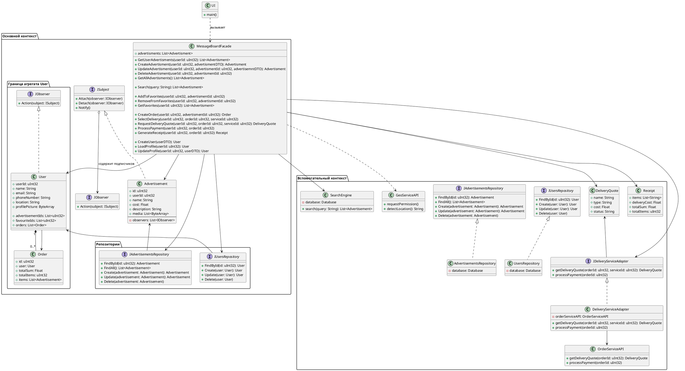

```plantuml
@startuml
class UI {
  + main()
}

package "Основной контекст" {

interface IObserver {
  + Action(subject: ISubject)
}

interface ISubject {
  + Attach(observer: IObserver)
  + Detach(observer: IObserver)
  + Notify()
}

ISubject o--> IObserver : "содержит подписчиков"

class MessageBoardFacade {
  + advertisments: List<Advertisment>

  + GetUserAdvertisments(userId: uInt32): List<Advertisment>
  + CreateAdvertisment(userId: uInt32, advertismentDTO): Advertisment
  + UpdateAdvertisment(userId: uInt32, advertismentId: uInt32, advertisemntDTO): Advertisment
  + DeleteAdvertisment(userId: uInt32, advertismentId: uInt32)
  + GetAllAdvertisments(): List<Advertisment>

  + Search(query: String): List<Advertisment>

  + AddToFavorites(userId: uInt32, advertismentId: uInt32)
  + RemoveFromFavorites(userId: uInt32, advertismentId: uInt32)
  + GetFavorites(userId: uInt32): List<Advertisment>

  + CreateOrder(userId: uInt32, advertismentId: uInt32): Order
  + SelectDelivery(userId: uInt32, orderId: uInt32, serviceId: uInt32)
  + RequestDeliveryQuote(userId: uInt32, orderId: uInt32, serviceId: uInt32): DeliveryQuote
  + ProcessPayment(userId: uInt32, orderId: uInt32)
  + GenerateReceipt(userId: uInt32, orderId: uInt32): Receipt

  + CreateUser(userDTO): User
  + LoadProfile(userId: uInt32): User
  + UpdateProfile(userId: uInt32, userDTO): User
}

package "Репозитории" {
interface IUsersRepository {
  + FindById(id: uInt32): User
  + Create(user: User): User
  + Update(user: User): User
  + Delete(user: User)
}

interface IAdvertisementsRepository {
  + FindById(id: uInt32): Advertisement
  + FindAll(): List<Advertisement>
  + Create(advertisement: Advertisement): Advertisement
  + Update(advertisement: Advertisement): Advertisement
  + Delete(advertisement: Advertisement)
}

}

  class Advertisement implements ISubject {
    + id: uInt32
    + userId: uInt32
    + name: String
    + cost: Float
    + description: String
    + media: List<ByteArray>
    --
    - observers: List<IObserver>
  }

package "Граница агрегата User" {
  class User implements IObserver {
    + userId: uInt32
    + name: String
    + email: String
    + phoneNumber: String
    + location: String
    + profilePicture: ByteArray

    + advertisementIds: List<uInt32>
    + favouriteIds: List<uInt32>
    + orders: List<Order>
  }

  class Order {
    + id: uInt32
    + user: User
    + totalSum: Float
    + totalItems: uInt32
    + items: List<Advertisement>
  }

  interface IObserver {
  + Action(subject: ISubject)
}
}

  MessageBoardFacade --> IUsersRepository
  MessageBoardFacade --> IAdvertisementsRepository
  MessageBoardFacade --> User
  User <-- IUsersRepository
  Advertisement <-- IAdvertisementsRepository
}

package "Вспомогательный контекст" {
class UsersRepository implements IUsersRepository{
  - database: Database
}

class AdvertisementsRepository implements IAdvertisementsRepository {
  - database: Database
}

interface IDeliveryServiceAdapter {
  + getDeliveryQuote(orderId: uInt32, serviceId: uInt32): DeliveryQuote
  + processPayment(orderId: uInt32)
}

class SearchEngine {
  - database: Database
  + search(query: String): List<Advertisement>
}

class DeliveryServiceAdapter implements IDeliveryServiceAdapter {
  - orderServiceAPI: OrderServiceAPI
  + getDeliveryQuote(orderId: uInt32, serviceId: uInt32): DeliveryQuote
  + processPayment(orderId: uInt32)
}

class OrderServiceAPI {
  + getDeliveryQuote(orderId: uInt32): DeliveryQuote
  + processPayment(orderId: uInt32)
}

class GeoServiceAPI {
  + requestPermission()
  + detectLocation(): String
}

class DeliveryQuote {
  + name: String
  + type: String
  + cost: Float
  + status: String
}

class Receipt {
  + items: List<String>
  + deliveryCost: Float
  + totalSum: Float
  + totalItems: uInt32
}
interface IUsersRepository {
  + FindById(id: uInt32): User
  + Create(user: User): User
  + Update(user: User): User
  + Delete(user: User)
}

interface IAdvertisementsRepository {
  + FindById(id: uInt32): Advertisement
  + FindAll(): List<Advertisement>
  + Create(advertisement: Advertisement): Advertisement
  + Update(advertisement: Advertisement): Advertisement
  + Delete(advertisement: Advertisement)
}

}

UI ..> MessageBoardFacade : вызывает

MessageBoardFacade --> Receipt

MessageBoardFacade --> DeliveryQuote
DeliveryQuote <-- IDeliveryServiceAdapter

Order <-- User

MessageBoardFacade --> Advertisement


MessageBoardFacade --> IDeliveryServiceAdapter
MessageBoardFacade --> SearchEngine
MessageBoardFacade ..> GeoServiceAPI

DeliveryServiceAdapter --> OrderServiceAPI

User "1" *-- "0..*" Order
@enduml
```
