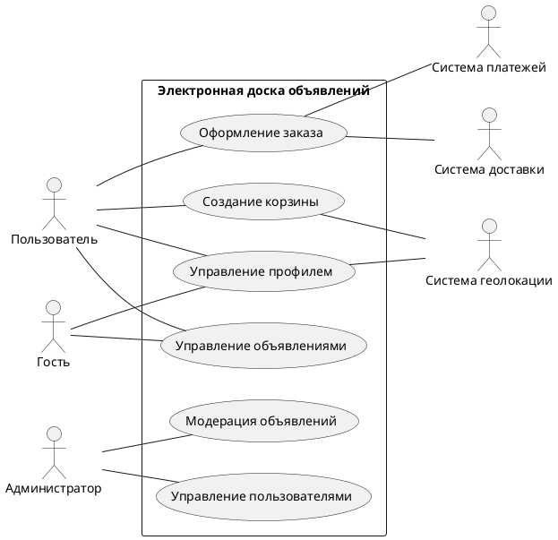

```plantuml
@startuml
skinparam packageStyle rect
left to right direction

:Пользователь:
:Администратор:
:Гость:
:Система доставки:
:Система платежей:
:Система геолокации:

package "Электронная доска объявлений" {

:Гость: -- (Управление объявлениями)
:Гость: -- (Управление профилем)

:Пользователь: -- (Создание корзины)
:Пользователь: -- (Оформление заказа)
:Пользователь: -- (Управление профилем)
:Пользователь: -- (Управление объявлениями)

:Администратор: -- (Модерация объявлений)
:Администратор: -- (Управление пользователями)

(Оформление заказа) -- :Система платежей: 
(Оформление заказа) -- :Система доставки:
(Создание корзины) -- :Система геолокации:
(Управление профилем) -- :Система геолокации:
}
@enduml
```
