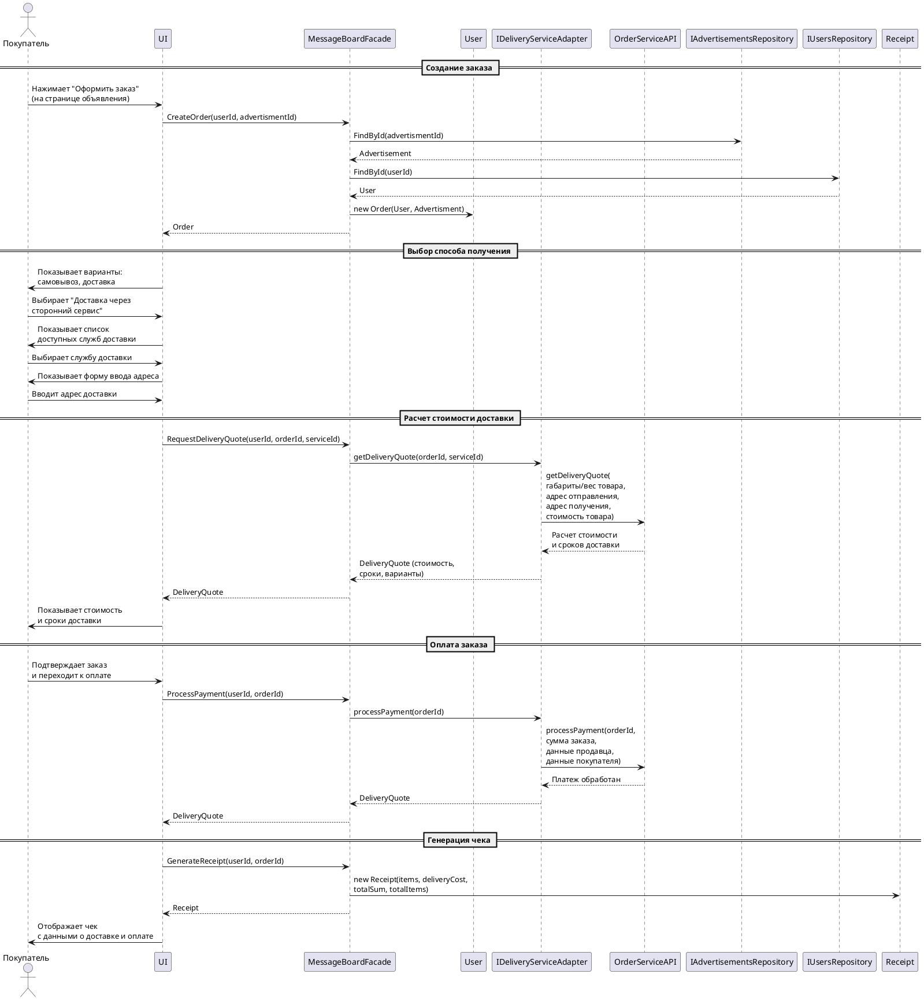

```plantuml
@startuml
actor Покупатель
participant "UI" as UI
participant "MessageBoardFacade" as MBF
participant "User" as Order
participant "IDeliveryServiceAdapter" as Adapter
participant "OrderServiceAPI" as DeliveryAPI
participant "IAdvertisementsRepository" as AdvRepo
participant "IUsersRepository" as UserRepo
' participant "Advertisement" as Ad
' participant "User" as Seller
' participant "User" as Buyer
participant "Receipt" as Receipt

== Создание заказа ==

Покупатель -> UI: Нажимает "Оформить заказ"\n(на странице объявления)

UI -> MBF: CreateOrder(userId, advertismentId)
MBF -> AdvRepo: FindById(advertismentId)
AdvRepo --> MBF: Advertisement
MBF -> UserRepo: FindById(userId)
UserRepo --> MBF: User
MBF -> Order: new Order(User, Advertisment)
MBF --> UI: Order

== Выбор способа получения ==

UI -> Покупатель: Показывает варианты:\nсамовывоз, доставка

Покупатель -> UI: Выбирает "Доставка через\nсторонний сервис"

UI -> Покупатель: Показывает список\nдоступных служб доставки

Покупатель -> UI: Выбирает службу доставки

UI -> Покупатель: Показывает форму ввода адреса

Покупатель -> UI: Вводит адрес доставки

== Расчет стоимости доставки ==

UI -> MBF: RequestDeliveryQuote(userId, orderId, serviceId)

MBF -> Adapter: getDeliveryQuote(orderId, serviceId)

Adapter -> DeliveryAPI: getDeliveryQuote(\nгабариты/вес товара,\nадрес отправления,\nадрес получения,\nстоимость товара)

DeliveryAPI --> Adapter: Расчет стоимости\nи сроков доставки

Adapter --> MBF: DeliveryQuote (стоимость,\nсроки, варианты)

MBF --> UI: DeliveryQuote

UI -> Покупатель: Показывает стоимость\nи сроки доставки

== Оплата заказа ==

Покупатель -> UI: Подтверждает заказ\nи переходит к оплате

UI -> MBF: ProcessPayment(userId, orderId)

MBF -> Adapter: processPayment(orderId)

Adapter -> DeliveryAPI: processPayment(orderId,\nсумма заказа,\nданные продавца,\nданные покупателя)

DeliveryAPI --> Adapter: Платеж обработан
Adapter --> MBF: DeliveryQuote
MBF --> UI: DeliveryQuote

== Генерация чека ==

UI -> MBF: GenerateReceipt(userId, orderId)

MBF -> Receipt: new Receipt(items, deliveryCost, \ntotalSum, totalItems)

MBF --> UI: Receipt

UI -> Покупатель: Отображает чек\nс данными о доставке и оплате
@enduml
```
