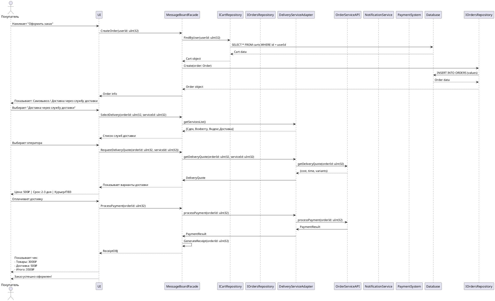

```plantuml
@startuml
actor Покупатель
participant "UI" as UI
participant "MessageBoardFacade" as Facade
participant "ICartRepository" as CartRepo
participant "IOrdersRepository" as OrderRepo
participant "DeliveryServiceAdapter" as DeliveryAdapter
participant "OrderServiceAPI" as DeliveryAPI
participant "NotificationService" as NotifyService
participant "PaymentSystem" as Payment
participant "Database" as DB

Покупатель -> UI: Нажимает "Оформить заказ"
UI -> Facade: СreateOrder(userId: uInt32)
Facade -> CartRepo: FindByUser(userId: uInt32)
CartRepo -> DB: SELECT * FROM carts WHERE id = userId
DB --> CartRepo: Cart data
CartRepo --> Facade: Cart object
Facade -> IOrdersRepository: Create(order: Order)
IOrdersRepository -> DB: INSERT INTO ORDERS (values)
DB --> IOrdersRepository : Order data
IOrdersRepository --> Facade: Order object

Facade -> UI: Order info
UI --> Покупатель: Показывает: Самовывоз / Доставка через службу доставки

Покупатель -> UI: Выбирает "Доставка через службу доставки"
UI -> Facade: SelectDelivery(orderId: uInt32, serviceId: uInt32)
Facade -> DeliveryAdapter: getServicesList()
DeliveryAdapter --> Facade: [Сдек, Boxberry, Яндекс.Доставка]
Facade --> UI: Список служб доставки

Покупатель -> UI: Выбирает оператора
UI -> Facade: RequestDeliveryQuote(orderId: uInt32, serviceId: uInt32))

Facade -> DeliveryAdapter: getDeliveryQuote(orderId: uInt32, serviceId: uInt32)
DeliveryAdapter -> DeliveryAPI: getDeliveryQuote(orderId: uInt32)
DeliveryAPI --> DeliveryAdapter: {cost, time, variants}
DeliveryAdapter -> Facade: DeliveryQuote

Facade --> UI: Показывает варианты доставки
UI --> Покупатель: Цена: 500₽ | Срок: 2-3 дня | Курьер/ПВЗ

Покупатель -> UI: Оплачивает доставку
UI -> Facade: ProcessPayment(orderId: uInt32)
Facade -> DeliveryAdapter:processPayment(orderId: uInt32)
DeliveryAdapter -> DeliveryAPI: processPayment(orderId: uInt32)
DeliveryAPI -> DeliveryAdapter: PaymentResult
DeliveryAdapter -> Facade: PaymentResult
Facade -> Facade: GenerateReceipt(orderId: uInt32)
Facade --> UI: ReceiptOBJ

UI --> Покупатель: Показывает чек:\n- Товары: 3000₽\n- Доставка: 500₽\n- Итого: 3500₽

UI --> Покупатель: Заказ успешно оформлен!
@enduml
```
