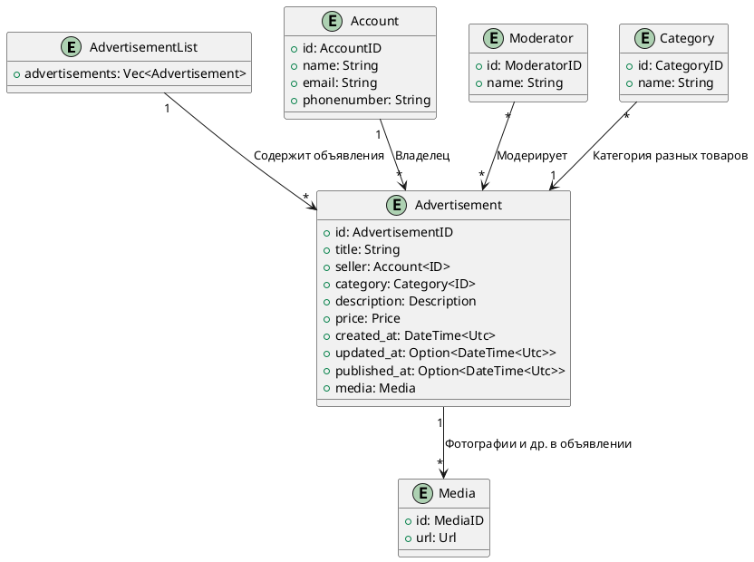

```plantuml
@startuml
entity AdvertisementList {
  +advertisements: Vec<Advertisement>
}

entity Account {
  +id: AccountID
  +name: String
  +email: String
  +phonenumber: String
}

entity Moderator {
  +id: ModeratorID
  +name: String
}

entity Advertisement {
  +id: AdvertisementID
  +title: String
  +seller: Account<ID>
  +category: Category<ID>
  +description: Description
  +price: Price
  +created_at: DateTime<Utc>
  +updated_at: Option<DateTime<Utc>>
  +published_at: Option<DateTime<Utc>>
  +media: Media 
}

entity Media {
  +id: MediaID
  +url: Url
}

entity Category {
  +id: CategoryID
  +name: String
}

AdvertisementList "1" --> "*" Advertisement : Содержит объявления

Account  "1" --> "*" Advertisement: Владелец
Moderator "*" --> "*" Advertisement : Модерирует

Advertisement "1" --> "*" Media : Фотографии и др. в объявлении
Category "*" --> "1" Advertisement : Категория разных товаров
@enduml
```
