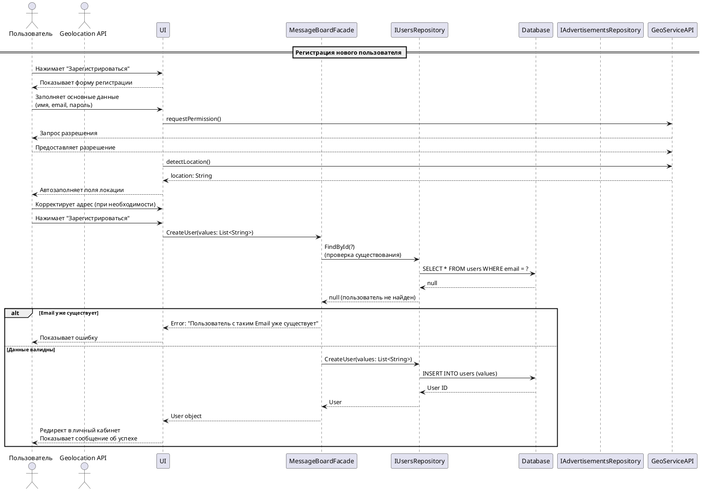

```plantuml
@startuml
actor Пользователь
actor "Geolocation API" as GeoAPI
participant "UI" as UI
participant "MessageBoardFacade" as Facade
participant "IUsersRepository" as UserRepo
participant "Database" as DB
participant "IAdvertisementsRepository" as AdsRepo
participant "GeoServiceAPI" as GeoService

== Регистрация нового пользователя ==

Пользователь -> UI: Нажимает "Зарегистрироваться"
UI --> Пользователь: Показывает форму регистрации

Пользователь -> UI: Заполняет основные данные\n(имя, email, пароль)
UI -> GeoService: requestPermission()
GeoService --> Пользователь: Запрос разрешения
Пользователь --> GeoService: Предоставляет разрешение

UI -> GeoService: detectLocation()
GeoService --> UI: location: String

UI --> Пользователь: Автозаполняет поля локации

Пользователь -> UI: Корректирует адрес (при необходимости)
Пользователь -> UI: Нажимает "Зарегистрироваться"

UI -> Facade: CreateUser(values: List<String>)
Facade -> UserRepo: FindById(?) \n(проверка существования)
UserRepo -> DB: SELECT * FROM users WHERE email = ?
DB --> UserRepo: null
UserRepo --> Facade: null (пользователь не найден)

alt Email уже существует
    Facade --> UI: Error: "Пользователь с таким Email уже существует"
    UI --> Пользователь: Показывает ошибку
else Данные валидны
    Facade -> UserRepo: CreateUser(values: List<String>)
    UserRepo -> DB: INSERT INTO users (values)
    DB --> UserRepo: User ID
    UserRepo --> Facade: User 
    
    Facade --> UI: User object
    UI --> Пользователь: Редирект в личный кабинет\nПоказывает сообщение об успехе
end
@enduml
```
